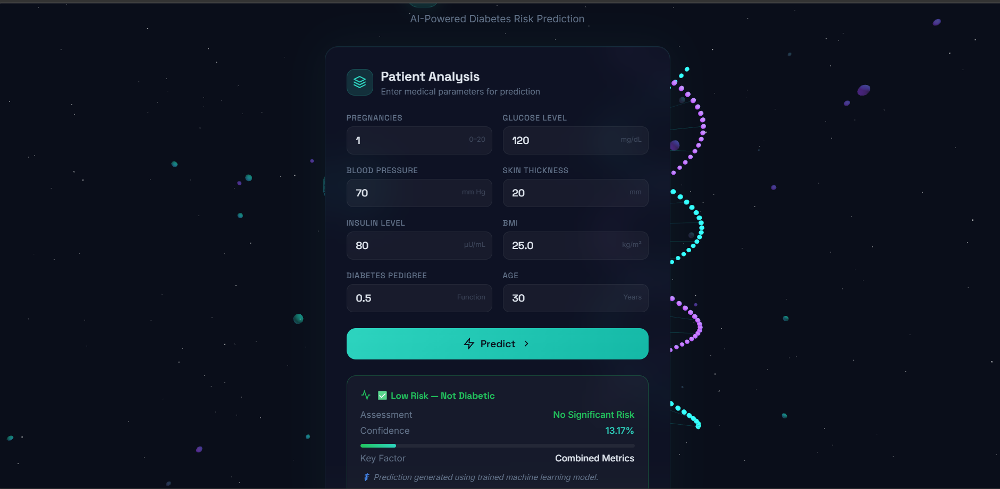
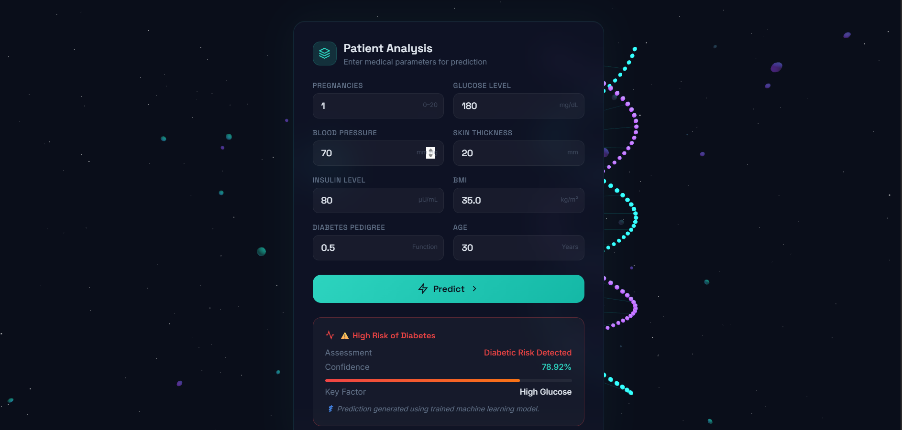

# MediScan Lite 🩺

A full-stack machine learning web application that predicts diabetes risk using patient health data. Built with Flask backend and a modern interactive frontend, delivering real-time predictions with confidence scores.

## 🚀 Technologies Used

* Python
* Pandas, NumPy
* Scikit-learn
* Flask (Backend)
* HTML, CSS, JavaScript (Frontend)
  

## ✨ Features

* Accepts user health inputs (Glucose, BMI, Age, etc.)
* Real-time prediction using trained ML model
* Displays prediction with confidence percentage
* Modern and responsive UI with animations
* Fast and lightweight web application

## 🧠 Model Details

* Algorithm Used: Support Vector Machine (SVM)
* Dataset: Pima Indians Diabetes Dataset
* Accuracy: ~75% - 80%

## 🔄 Workflow

1. Data Collection
2. Data Preprocessing
3. Model Training
4. Model Evaluation
5. Deployment using Flask

## ⚙️ How to Run

1. Clone the repository:
   git clone https://github.com/chinmaya-dev77/MEDISCANLITE.git

2. Navigate to the project folder:
   cd MEDISCANLITE

3. Install dependencies:
   pip install -r requirements.txt

4. Run the application:
   python app.py

5. Open in browser:
   (https://mediscanlite.onrender.com)

## 📁 Project Structure

MEDISCANLITE/
│
├── app.py
├── model.py
├── model.pkl
├── model_compare.py
├── requirements.txt
├── README.md
│
├── templates/
│   └── index.html
│
└── static/
├── style.css
└── script.js

## 🚀 Future Improvements

* Improve model accuracy using advanced algorithms
* Add explainable AI (feature importance)
* Deploy the application online
* Add user authentication and history tracking

## 👨‍💻 Author

* Chinmaya Kumar Prusty

## 📸 Screenshots

### 🟢 Low Risk Prediction

### 🔴 High Risk Prediction

